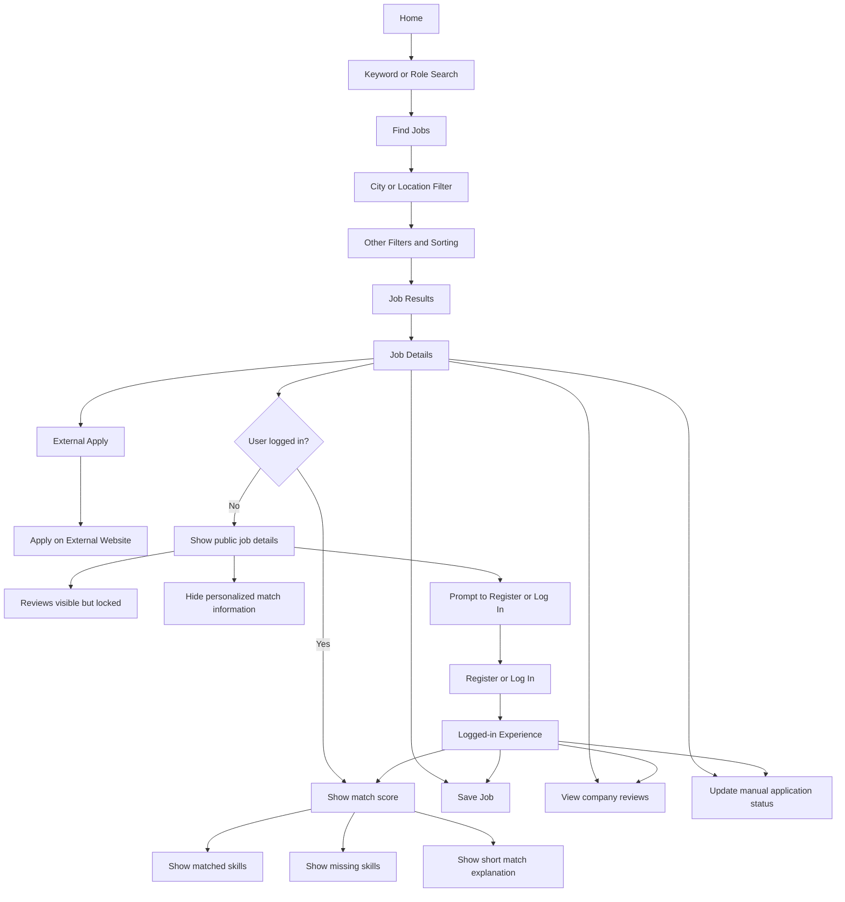
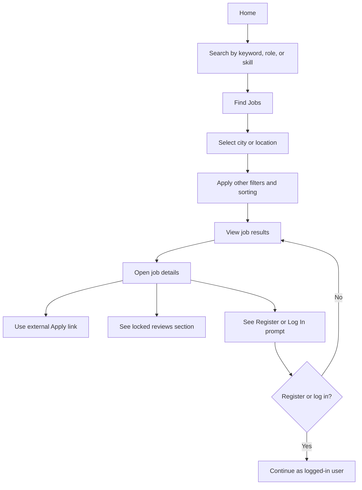
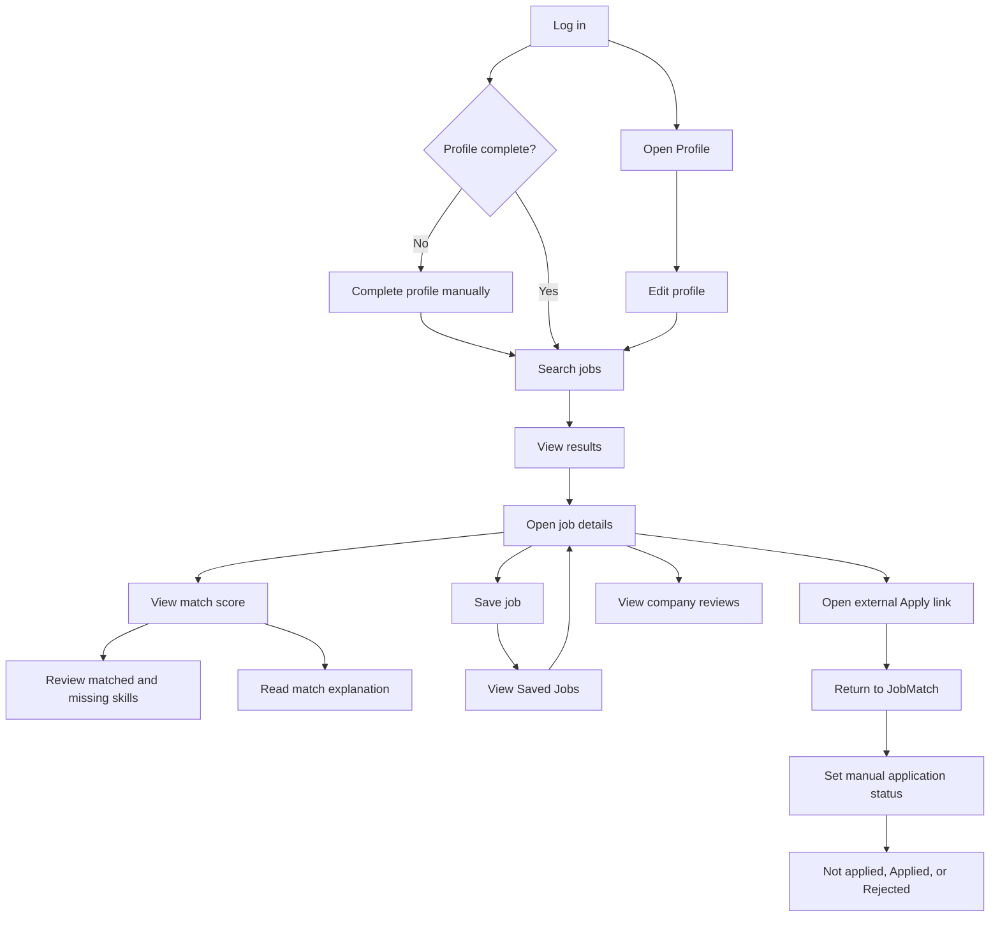
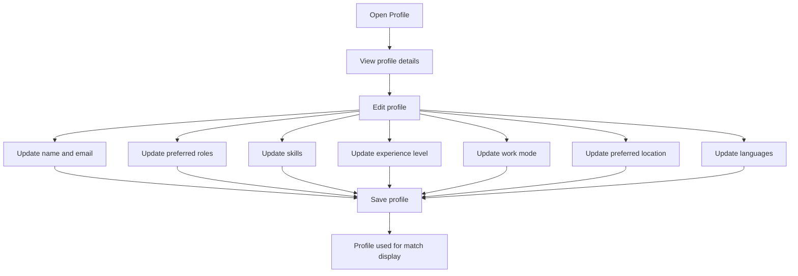

# JobMatch V1 User Journey

This document describes the intended V1 product journey for guest and logged-in users. The goal is to make the main decision points clear before detailed frontend implementation begins.

V1 uses keyword search on Home, then city/location refinement on Find Jobs. Province filtering is not included because the current data source does not reliably provide province-level information.

## Main Journey

## Guest Journey

Guests can browse jobs and apply externally. They cannot save jobs, see personalized match information, see full company reviews, or use profile-based personalization.

## Logged-In Journey

Logged-in users can complete and edit their profile manually, see match information, save jobs, view saved jobs, access company reviews, and manually track application status.

## Profile Flow

CV upload and AI CV parsing are outside V1. Profile completion is manual only.

## Key Decision Points

- The user may browse as a guest or register/log in for personalized features.
- Match information appears only for logged-in users with enough profile data.
- Saving jobs requires authentication.
- Company reviews are available only to logged-in users.
- Apply always sends the user to an external application page.
- Application status is tracked manually inside JobMatch after external apply.
